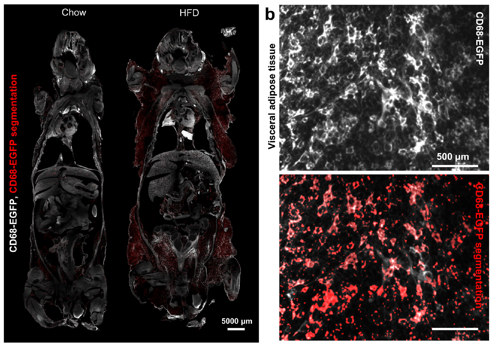
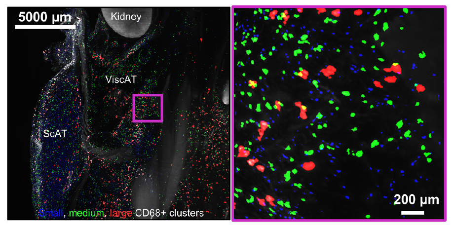
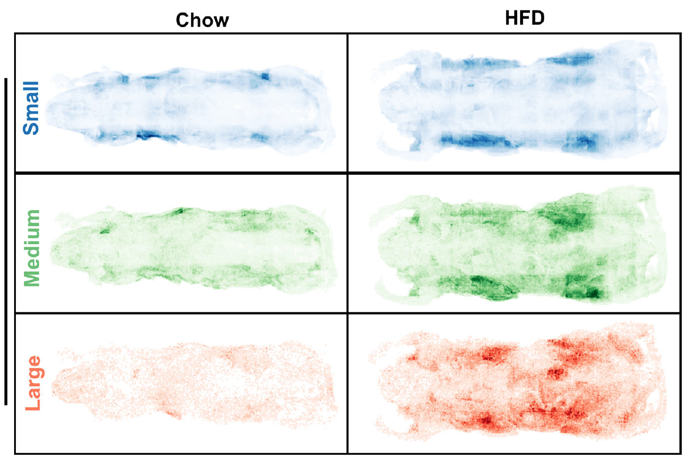
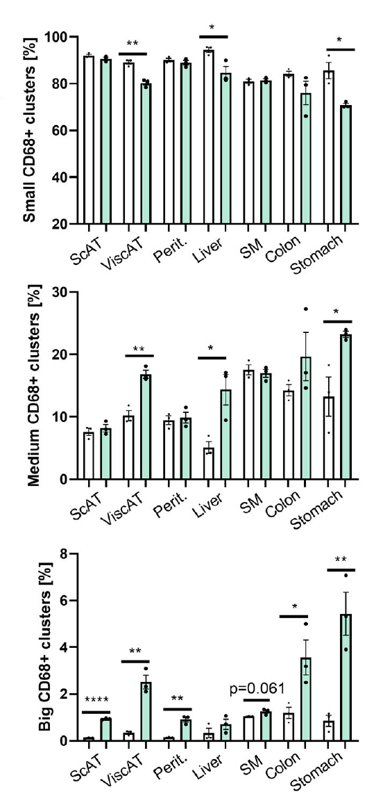

# Infmallation Marker Segmentation 




## Requirements
* Linux system with GPU (at least 24 GB GPU RAM) and CPU (at least 10 cores), and with 100 GB RAM.  
* Raw image data saved as a series of 16-bit TIFF files (.tif), one per z-plane. 
  
## Installation
* Install [CUDA](https://developer.nvidia.com/cuda-toolkit) and [cuDNN](https://developer.nvidia.com/cudnn).
* Install [Anaconda](https://www.anaconda.com/download#downloads) to create and control virtual environments.
* Install Python 3.10 or higher version by Anaconda.
  ```
    conda create -n env python=3.10
	conda activate env
	```
* Install [pytorch](https://pytorch.org/get-started/locally/).
* Install additional packages :
  '''
  pip install -r requirements.txt
  '''
Install [nnUNETv2](https://github.com/MIC-DKFZ/nnUNet/tree/master) following the instructions on their repository.
* Create folders `nnUNet_raw`, `nnUNet_preprocessed`, and `nnUNet_results`.
   
  
## Inflammation marker segmentation
* The [Inflammation_module](./Inflammation_module.ipynb) notebook will provide a walkthrough about how to use our pipeline.

* Download trained model zip from [here](../models/CD68_Model.zip), and select model 17268 . For setting it up, follow the instructions form [here] (https://github.com/MIC-DKFZ/nnUNet/blob/master/documentation/how_to_use_nnunet.md#how-to-deploy-and-run-inference-with-your-pretrained-models)

## Inflammation marker segmentation from cropped data
* Crop your tissue data with your solution of choice. The smaller the crops, the faster each patch will be segmented, and the less resources (RAM and CPU) you can get away with. This process can take up to 36 hours for large specimens.

* Place the trainer nnUNetTrainer_VesselFM5.py file into your nnUNetTrainer folder (for example, if you installed through pip, this might look like /home/$USER/miniconda3/envs/env/lib/python3.10/site-packages/nnunetv2/training/nnUNetTrainer/)

* Run CD68 marker segmentation inference cropped scan:
  ```
  nnUNetv2_predict -d 17268 -i path_ouput_preprocessing -o folder_out_pred -c 3d_fullres -tr nnUNetTrainer 
	```  

* This will run inference with the ensemble of the 5 folds. For faster inference, you can use only one fold and accelerate 5-fold, by specifying fold 0

  ```
  nnUNetv2_predict -d 17268 -i path_ouput_preprocessing -o folder_out_pred -c 3d_fullres -tr nnUNetTrainer -f 0
	```  

## Inflammation marker segmentation from full-resolution data
## Tissue segmentation on full uncropped data
* Download trained model zip from [here](../models/), and select model 17268 . For setting it up, follow the instructions form [here] (https://github.com/MIC-DKFZ/nnUNet/blob/master/documentation/how_to_use_nnunet.md#how-to-deploy-and-run-inference-with-your-pretrained-models)
* Preprocessing the 16 bit tiffs stacks to zarr:
```
  cd ../sliding_window_inference/
  python tif2zarr_single_or_dualCh.py -i /PATH_CHANEL_CD68/ -o /PATH_INPUT_ZARR.zarr/ -c 128,128,128

  ```  
* Run inference:
```
  CUDA_VISIBLE_DEVICES=0 python predict_from_dask.py -i PATH_INPUT_ZARR.zarr -o PATH_OUTPUT_ZARR.zarr -normalization zscore

  ```  
(Note: If you want to ensemble the result of 5 models in this setup, you manually need to run all 5 folds.)
* Export the prediction to tiff and zarr(optional, for blob extraction):
```
  python postprocess_segmentation_from_zarr.py -i /PATH_OUTPUT_ZARR.zarr -o /PATH_OUT_TIFF_SLICES/ -as_zarr=True

  ``` 

* Extract the blobs from zarr: Set the parameters in the main_extract_blobs_from_zarr.py file, then run it
```
  python main_extract_blobs_from_zarr.py

  ``` 

* Now the blobs will be saved into individual picklefiles which you can inspect and extract statistics regarding size, number, etc


## Extracting blob statistics
* Run blob extraction, to find individual connected components, and to measure their size. Prediction on a 500x500x500 sized patch is expected to take around 13 minutes. Howto in the jupyter notebook.
* Discard elongated structures as False Positives
* Categorize detected structures into different sizes


  
* Assign each detected cluster to a location



* Quantify distribution among organs


