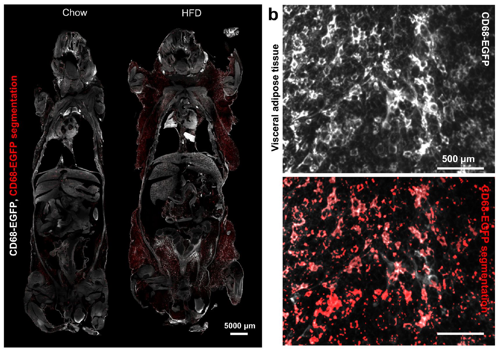
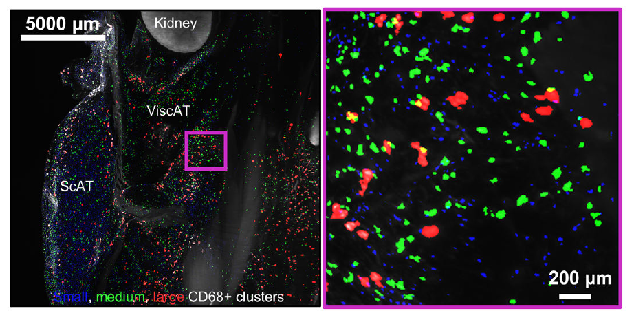
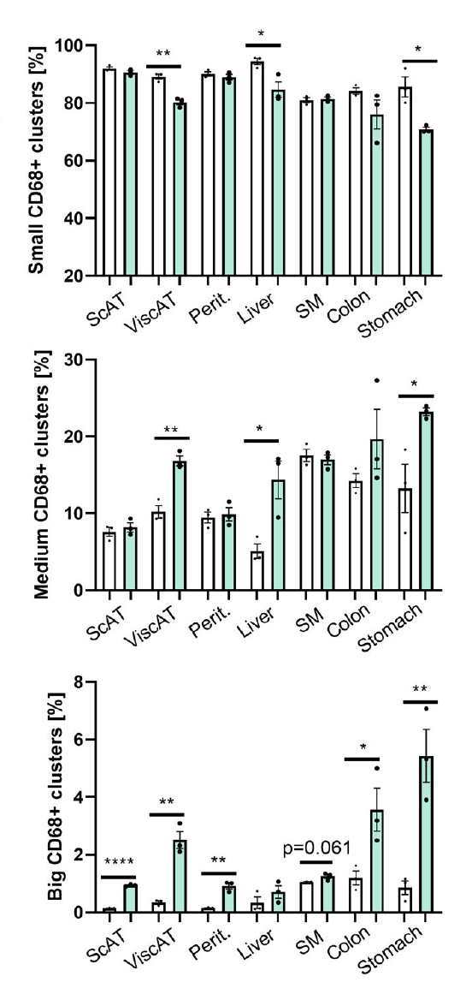

# Infmallation Marker Segmentation 




## Requirements
* Linux system with GPU (at least 24 GB GPU RAM) and CPU (at least 10 cores), and with 100 GB RAM.  
* Raw image data saved as a series of 16-bit TIFF files (.tif), one per z-plane. 
  
## Installation
* Install [CUDA](https://developer.nvidia.com/cuda-toolkit) and [cuDNN](https://developer.nvidia.com/cudnn).
* Install [Anaconda](https://www.anaconda.com/download#downloads) to create and control virtual environments.
* Install Python 3.9 or higher version by Anaconda.
  ```
    conda create -n env python=3.9
	conda activate env
	```
* Install [pytorch](https://pytorch.org/get-started/locally/).
* Install additional packages :
  '''
  connected-components-3d==3.10.5
  pandas==2.1.0
  '''
Install [nnUNETv2](https://github.com/MIC-DKFZ/nnUNet/tree/master) following the instructions on their repository.
* Create folders `nnUNet_raw`, `nnUNet_preprocessed`, and `nnUNet_results`.
   
  
## Inflammation marker segmentation
* The [Inflammation_module](./Inflammation_module.ipynb) notebook will provide a walkthrough about how to use our pipeline.

* Download trained model zip from [here](TODO), and select model 17068 . For setting it up, follow the instructions form [here] (https://github.com/MIC-DKFZ/nnUNet/blob/master/documentation/how_to_use_nnunet.md#how-to-deploy-and-run-inference-with-your-pretrained-models)
* Crop your tissue data with your solution of choice. The smaller the crops, the faster each patch will be segmented, and the less resources (RAM and CPU) you can get away with. This process can take up to 36 hours for large specimens.

* Run organ segmentation inference for a whole-body scan:
  ```
  nnUNetv2_predict -d 170680 -i path_ouput_preprocessing -o folder_out_pred -c 3d_fullres -tr nnUNetTrainer 
	```  
* Run blob extraction, to find individual connected components, and to measure their size. Prediction on a 500x500x500 sized patch is expected to take around 13 minutes.
* Discard elongated structures as False Positives
* Categorize detected structures into different sizes


  
* Assign each detected cluster to a location


* Quantify distribution among organs

