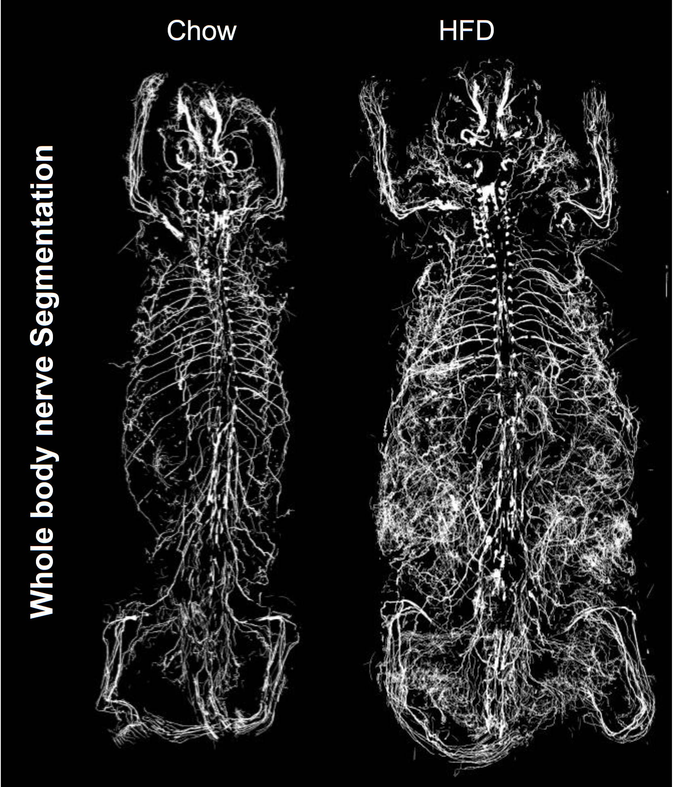

# Peripheral nerves segmentation


## Requirements
* Linux system with GPU (at least 10 GB GPU RAM) and CPU (at least 10 cores), and with 100 GB RAM.  
* Raw image data saved as a series of 16-bit TIFF files (.tif), one per z-plane. 
  
## Installation
* Install [CUDA](https://developer.nvidia.com/cuda-toolkit) and [cuDNN](https://developer.nvidia.com/cudnn).
* Install [Anaconda](https://www.anaconda.com/download#downloads) to create and control virtual environments.
* Install Python 3.9 or higher version by Anaconda.
  ```
    conda create -n env python=3.9
	conda activate env
	```
* Install [pytorch](https://pytorch.org/get-started/locally/).
* Install additional required libraries:
     ```
     cd ./nerve_segmentation
     pip install -e .
	```
* Create folders `nnUNet_raw_data_base`, `nnUNet_preprocessed`, `RESULTS_FOLDER` under [this folder](../Nerve_Module/) for storing raw data, preprocessed data and trained models, and set the three folders as environment variables:
  ```
   export nnUNet_raw_data_base="{dir_whole_repo}/nerve_segmentation/nnUNet_raw_data_base"
   export nnUNet_preprocessed="{dir_whole_repo}/nerve_segmentation/nnUNet_preprocessed"
   export RESULTS_FOLDER="{dir_whole_repo}/nerve_segmentation/RESULTS_FOLDER"
	```  
  
## Nerve segmentation
* Download trained models and the plan file from [here](../models/nerve_segmentation), then put them in the created folder `RESULTS_FOLDER`.
* Download the example [nerve data](../Nerve_Module/example_data) for testing. The example data includes two folders: one containing raw tiff slices named `Image`, and a folder of annotation tiff slices named `Mask`.
* Compute the `Intensity_low` and `Intensity_high` for percentile normalization during the next inference step:
  ```
  cd {dir_whole_repo}/nerve_segmentation/nnunet/utilities/
  python stat_intensity_range_nozero.py -i RAW_TIFF_FOLDER -p 0.1
	``` 
* Run nerve segmentation inference for a whole-body scan or part of the scan, saved as a series of 16-bit TIFF files (.tif):
  ```
  cd {dir_whole_repo}/nerve_segmentation/nnunet/inference/
  CUDA_VISIBLE_DEVICES=0 python predict_simple_dask.py -i RAW_TIFF_FOLDER -o OUTPUT_NERVE_SEGMENTATION_FOLDER -min Intensity_low -max Intensity_low -mdl {dir_whole_repo}/nerve_segmentation/RESULTS_FOLDER/model_final_checkpoint.model -pl {dir_whole_repo}/nerve_segmentation/RESULTS_FOLDER/plans.pkl -bs 1 -overlap 0.75
	```  
  The nerve segmentation results will be saved as zarr files under the selected `OUTPUT_NERVE_SEGMENTATION_FOLDER`.
* Convert infered segmentation results to tif slices:
  ```
  cd {dir_whole_repo}/nerve_segmentation/nnunet/utilities/
  python zarr2tif.py -i RAW_TIFF_FOLDER -o OUTPUT_NERVE_SEGMENTATION_FOLDER -pl {dir_whole_repo}/nerve_segmentation/RESULTS_FOLDER/plans.pkl
	```  
  The nerve segmentation results will be converted to tiff slices in a folder named `binary` under the selected `OUTPUT_NERVE_SEGMENTATION_FOLDER`.
## Nerve quantification
* Get the [organ segmentation](../organ_segmentation/) and [tissue segmentation](../tissue_segmentation/) for each mouse scan with a downsampling factor of 5 in both xy and z directions.
* Dilated the organ mask for head and the rest organs:
  ```
  cd {dir_whole_repo}/nerve_segmentation/quantification/
  python grow_organ_mask.py -i_mask PATH_ORGAN_SEGMENTATION -o_mask OUT_DILATEDMASK_FOLDER
	``` 
* Upsample the dilated head mask to a `HEAD_MASK_FOLDER`, the mask of the rest organs to a `ORGAN_MASK_FOLDER`, and tissue mask to a `TISSUE_MASK_FOLDER` following [instructions](../Tissue_Module/Organ_Segmentation.ipynb).
* Quantify nerve voxels/density in every organ/tissue:
  ```
  python quantification_nerve.py -nerve_mask OUTPUT_NERVE_SEGMENTATION_FOLDER -head_mask HEAD_MASK_FOLDER -organ_mask ORGAN_MASK_FOLDER -tissue_mask TISSUE_MASK_FOLDER -o_dir QUANTIFICATION_OUTPUTS_FOLDER
	```  
  The quantification results will be saved in csv files under the selected `QUANTIFICATION_OUTPUTS_FOLDER`.
