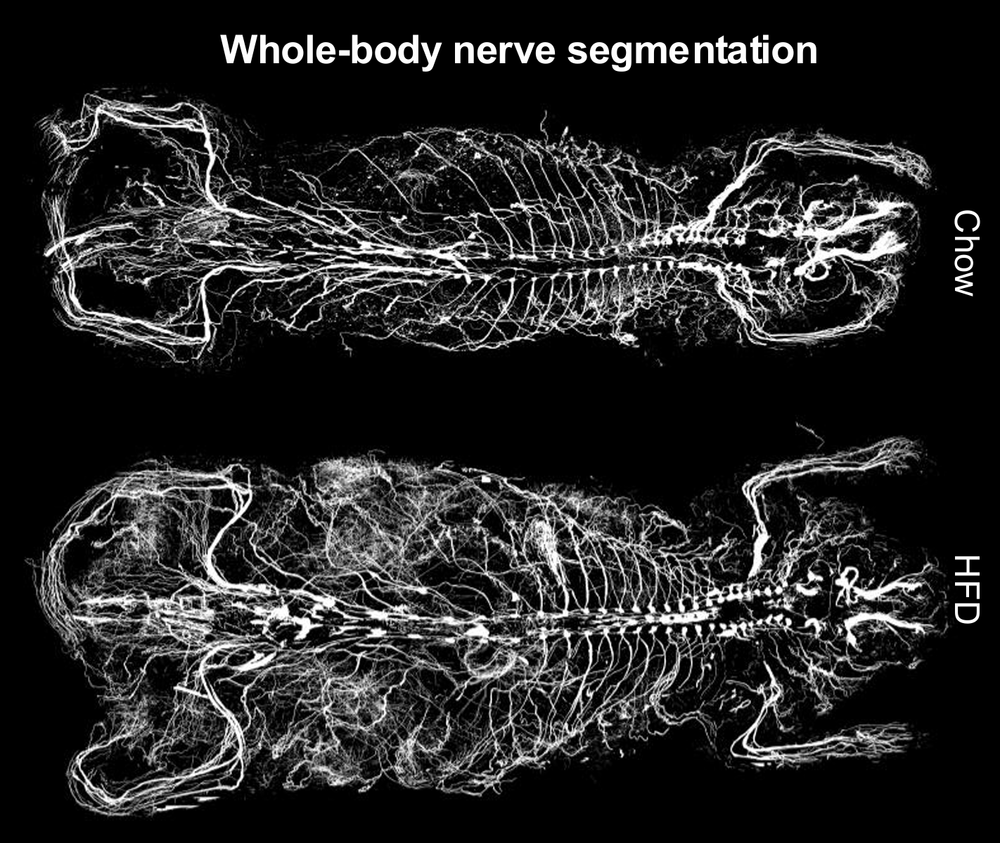

# Nerve segmentation


## Requirements
* Raw image data saved as a series of 16-bit TIFF files (.tif), one per z-plane. 
  
## Installation
* Install [CUDA](https://developer.nvidia.com/cuda-toolkit) and [cuDNN](https://developer.nvidia.com/cudnn).
* Install [Anaconda](https://www.anaconda.com/download#downloads) to create and control virtual environments.
* Install Python 3.10 or higher version by Anaconda.
  ```
    conda create -n env python=3.10
	conda activate env
	```
* Install [pytorch](https://pytorch.org/get-started/locally/)<=2.5.1.
* Install required libraries for nerve segmentation:
     ```
     cd {dir_whole_repo}/Nerve_Module
     cd inference
     pip install -r requirements.txt
	```
  `dir_whole_repo` refers to the directory where the entire repository is stored on your local device.
* Install other required libraries for nerve quantification:
     ```
     cd ..
     cd quantification
     pip install -r requirements.txt
	```
  
## Nerve segmentation
* Download trained models from [here](../models/NerveModel.zip)
* Download the [example data](../Nerve_Module/example_data) for testing and uncompress them. The example data is part of one trigeminal nerve. It includes two parts: one containing raw tiff slices named `raw`, and a folder of annotation tiff slices named `gt`.
* Convert raw tiff slices into Zarr file, then compute the `INTENSITY_LOW` and `INTENSITY_HIGH` for percentile normalization during the next inference step:
  ```
  cd inference
  python tif2zarr.py -i RAW_TIFF_FOLDER -o RAW_ZARR_PATH
  python zarr_intensity_stat.py -i RAW_ZARR_PATH -p 0.1
	``` 
  `RAW_TIFF_FOLDER` refers to the folder containing raw tiff slices;
  `RAW_ZARR_PATH` refers to the Zarr file path (end with .zarr).

  The output of the last line is [`INTENSITY_LOW`, `INTENSITY_HIGH`]
* Run nerve segmentation for the raw Zarr file, and convert infered segmentation results into binarized tiff slices:
  ```
  CUDA_VISIBLE_DEVICES=0 python predict_simple_dask.py -i RAW_ZARR_PATH -o OUTPUT_NERVE_SEGMENTATION_DIR -m MODEL_PATH -id IDENTIFIER -thresh THRESHOLD -min INTENSITY_LOW -max INTENSITY_HIGH -bs BATCH_SIZE
  python zarr2tif.py -i OUTPUT_NERVE_SEGMENTATION_DIR -id IDENTIFIER
	```  
  `MODEL_PATH` is the path of the download model checkpoint;
  `IDENTIFIER` is used to index the infered output.
  
  The nerve segmentation results will be saved as tiff slices under the selected `{OUTPUT_NERVE_SEGMENTATION_FOLDE}/binary_{IDENTIFIER}`.


  For the [example data](../Nerve_Module/example_data) whose size is 960×776×504, the inference time is around half an hour. 

## Nerve quantification
* Get the organ mask and tissue mask from the Tissue Module.
* Downsample the tissue mask to the same size as the organ mask. Please refer to the [instructions](../Tissue_Module/Organ_Segmentation.ipynb) here for the downsampling process.
Both organ mask and tissue mask are saved as `.nii.gz` file.
* Following the steps in [get_masks_for_quantification.ipynb](../Nerve_Module/quantification/get_masks_for_quantification.ipynb), preparing expanded organ mask, tissue mask, whole body mask and head mask for quantification

* Upsample the above masks to the size of orginal raw image and save them as tiff slices to folders `WB_MASK_FOLDER`, `TISSUE_MASK_FOLDER`, `ORGAN_MASK_GROW_FOLDER` and `HEAD_MASK_FOLDER`. Please refer to the [instructions](../Tissue_Module/Organ_Segmentation.ipynb) here for the upsampling process.

* Quantify nerve voxels/density in every organ/tissue:
  ```
  python quantification_nerve.py -nerve_mask {OUTPUT_NERVE_SEGMENTATION_FOLDE}/binary_{IDENTIFIER} -wb_mask WB_MASK_FOLDER -head_mask HEAD_MASK_FOLDER -organ_mask ORGAN_MASK_GROW_FOLDER -tissue_mask TISSUE_MASK_FOLDER -o QUANTIFICATION_OUTPUTS_FOLDER
	```  
  The quantification results will be saved in csv files under `QUANTIFICATION_OUTPUTS_FOLDER`.
