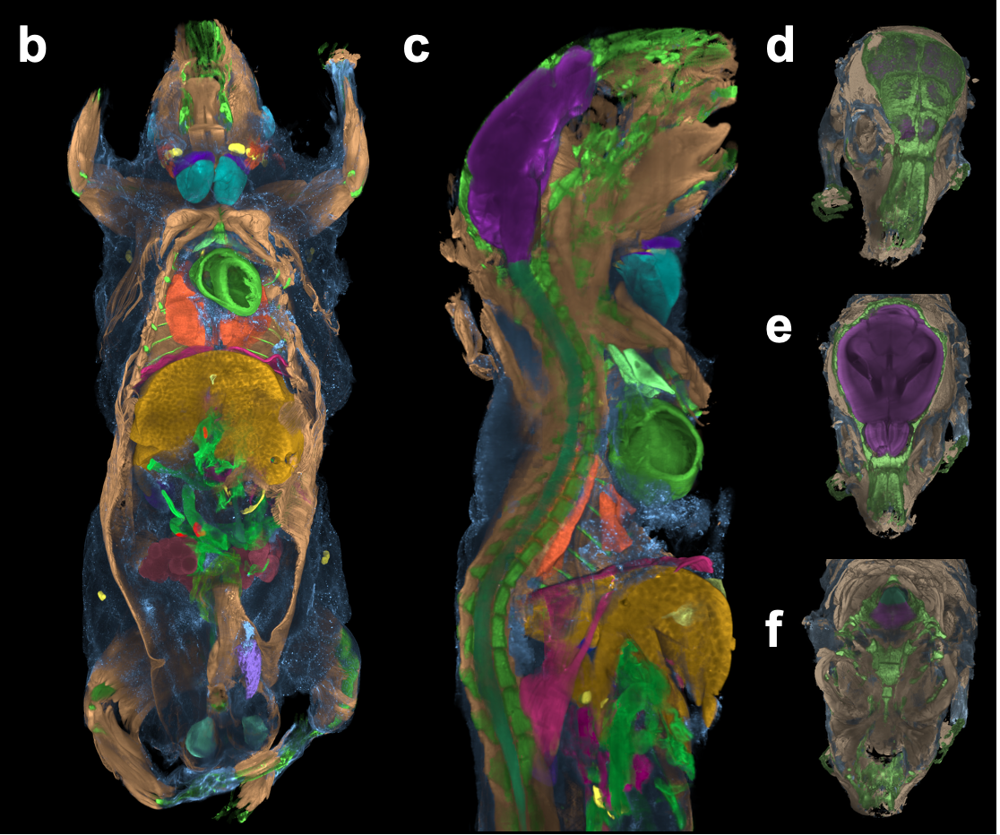
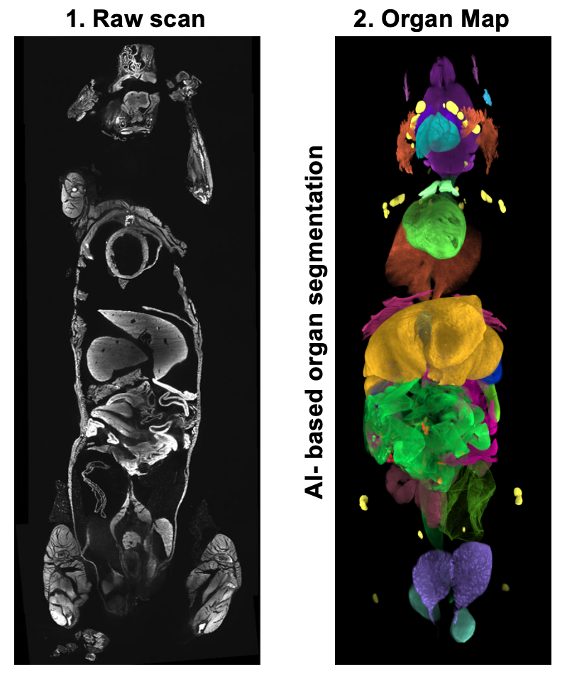
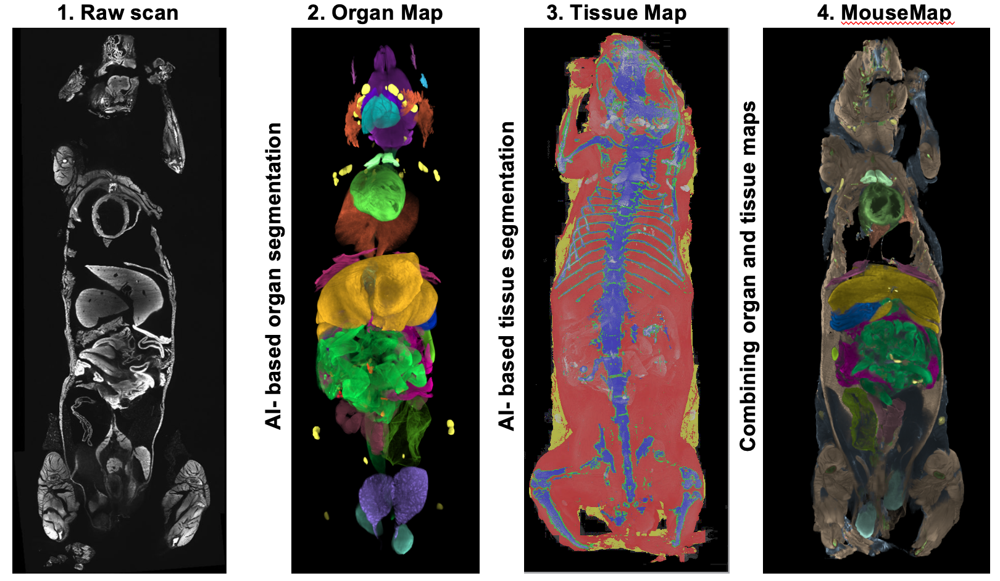
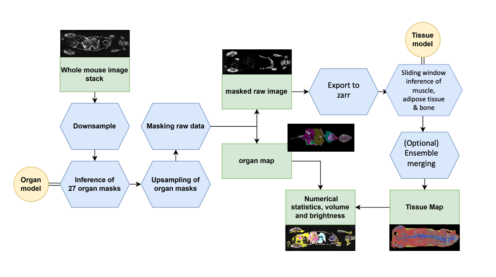

# Tissue (Internal Organs + Soft tissue) Module



## Requirements
* Linux system with GPU (at least 24 GB GPU RAM) and CPU (at least 10 cores), and with 100 GB RAM.  
* Raw image data saved as a series of 16-bit TIFF files (.tif), one per z-plane. 
  
## Installation
* Install [CUDA](https://developer.nvidia.com/cuda-toolkit) and [cuDNN](https://developer.nvidia.com/cudnn).
* Install [Anaconda](https://www.anaconda.com/download#downloads) to create and control virtual environments.
* Install Python 3.10 or higher version by Anaconda.
  ```
    conda create -n env python=3.10
	conda activate env
	```
* Install [pytorch](https://pytorch.org/get-started/locally/).
Install [nnUNETv2](https://github.com/MIC-DKFZ/nnUNet/tree/master) following the instructions on their repository.
* Install additional required libraries:
  ```
   pip install -r requirements.txt
	```
* Create folders `nnUNet_raw`, `nnUNet_preprocessed`, and `nnUNet_results`.
   
  
## Organ segmentation
* Download trained model zip from [here](../models/OrganModel.zip), and select model 998 . For setting it up, follow the instructions form [here] (https://github.com/MIC-DKFZ/nnUNet/blob/master/documentation/how_to_use_nnunet.md#how-to-deploy-and-run-inference-with-your-pretrained-models)
* Run organ downsampling. You can find the necessary code and an exampl in [Organ_Segmentation.ipynp](./Organ_Segmentation.ipynb)
* Run organ segmentation inference for a whole-body scan:
  ```
  nnUNetv2_predict -d 998 -i path_ouput_preprocessing -o folder_out_pred -c 3d_fullres -tr nnUNetTrainer 
	```  
* Prediction on a downsampled mouse is expected to take up to 10 minutes. Postprocess the predictions
* Upsample the resulting masks
* Optional : create masked non-organ slices for the downstream tissue segmentation


  

## Tissue segmentation on cropped data
* Download trained model zip from [here](../models/Tissue_model.zip), and select model 310 . For setting it up, follow the instructions form [here] (https://github.com/MIC-DKFZ/nnUNet/blob/master/documentation/how_to_use_nnunet.md#how-to-deploy-and-run-inference-with-your-pretrained-models)
* Crop your tissue data with your solution of choice. The smaller the crops, the faster each patch will be segmented, and the less resources (RAM and CPU) you can get away with.
* Run organ segmentation inference for a whole-body scan:
  ```
  nnUNetv2_predict -d 310 -i path_ouput_preprocessing -o folder_out_pred -c 3d_fullres -tr nnUNetTrainer 
	```  
* Prediction on a 500x500x500 sized patch is expected to take around 13 minutes. Merge the resulting patches back to the original resolution


## Tissue segmentation on full uncropped data
* Download trained model zip from [here](../models/Tissue_model.zip), and select model 310 . For setting it up, follow the instructions form [here] (https://github.com/MIC-DKFZ/nnUNet/blob/master/documentation/how_to_use_nnunet.md#how-to-deploy-and-run-inference-with-your-pretrained-models)
* Preprocessing the 16 bit tiffs stacks to zarr:
```
  cd ../sliding_window_inference/
  python tif2zarr_single_or_dualCh.py -i /PATH_CHANEL_AUTOFLUO/ -i2 /PATH_CHANNEL_PI/ -o /PATH_INPUT_ZARR.zarr/ -c 2,128,128,128

	```  
* Run inference:
```
  CUDA_VISIBLE_DEVICES=0 python predict_from_dask_tissue.py -i PATH_INPUT_ZARR.zarr -o PATH_OUTPUT_ZARR.zarr

	```  
(Note: If you want to ensemble the result of 5 models in this setup, you manually need to run all 5 folds.)
* Export the prediction to tiff:
```
  python postprocess_segmentation_from_zarr.py -i /PATH_OUTPUT_ZARR.zarr -o /PATH_OUT_TIFF_SLICES/

	``` 






